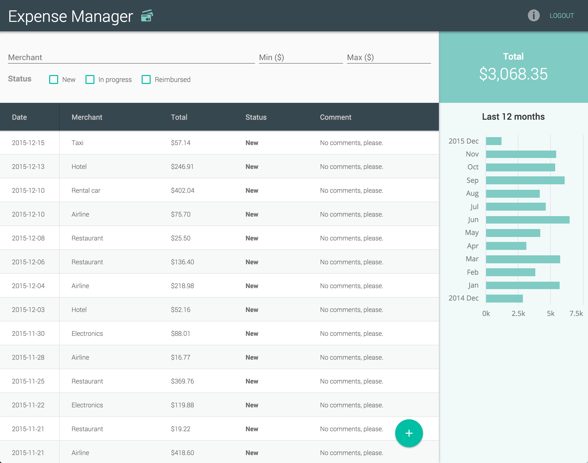

# Vaadin Expense Manager demo

Sources for the Expense Manager demo https://demo.vaadin.com/expense-manager. The demo is using [Vaadin Elements](https://www.vaadin.com/elements) and [Polymer](http://polymer-project.org).

## Running the app

You have two options for running the application - either standalone client or together with a server for a full stack progressive web application. If you only want to use the client, just skip the server startup.

### Running the server

1. Make sure you have Mongo DB installed on your computer
2. Go into the `server` directory and run `npm install` to download dependencies.
3. Once finished, run `node server.js` to start the server on localhost:8080

### Running the client

1. Go into the `client` directory
2. Run `npm install && bower install` to download dependencies.
3. Start the development server with `gulp serve` (will start with BrowserSync)

## License
Source code is released under Apache 2.0 License

The application uses the Vaadin Charts, which is released under the Commercial Vaadin Addon License: https://vaadin.com/license/cval-3
